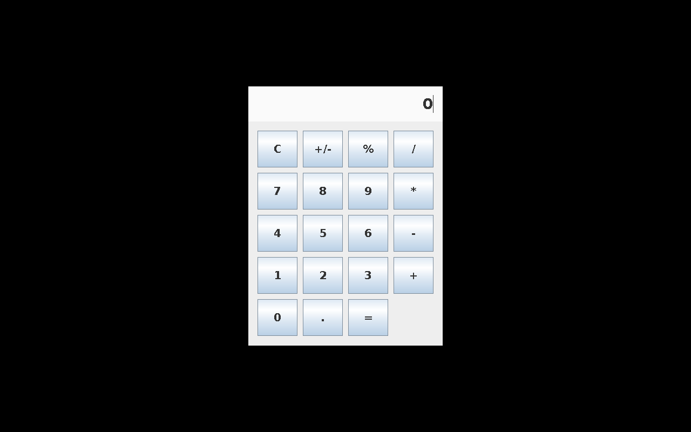
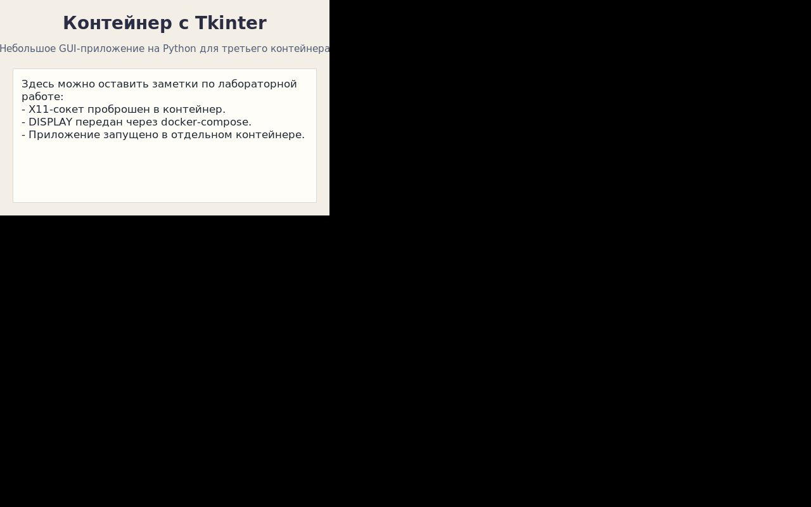

# Практическая работа: GUI-приложения в Docker

В работе развёрнуты три оконных приложения в отдельных контейнерах:

1. `xeyes` как стандартная X11-утилита.
2. `calc.jar` как Java Swing-приложение с графическим интерфейсом.
3. `python-gui` как дополнительное GUI-приложение на Python `tkinter`.

Все три сервиса запускаются одновременно через `docker-compose.yml`.

## Структура проекта

```text
.
├── calc
│   ├── Dockerfile
│   └── src
│       └── CalculatorApp.java
├── docker-compose.yml
├── python-gui
│   ├── app.py
│   └── Dockerfile
├── README.md
├── scripts
│   └── capture_screenshots.sh
└── xeyes
    └── Dockerfile
```

## 1. Почему для GUI в Docker нужен X11

Docker-контейнер по умолчанию не имеет собственного рабочего стола и не умеет отображать окна на экране хоста. Поэтому контейнеру нужно передать доступ к X-серверу хоста:

- через переменную `DISPLAY`, которая показывает, в какой X-сервер отправлять окна;
- через сокет `/tmp/.X11-unix`, по которому X-клиент внутри контейнера связывается с X-сервером;
- при необходимости через `xhost` или `xauth`, чтобы разрешить подключение контейнера к X-серверу.

В этой работе основной способ запуска сделан именно через проброс X11, как требуется в задании.

## 2. Контейнер с `xeyes`

Файл: [xeyes/Dockerfile](/Users/andrey/Desktop/mdk/xeyes/Dockerfile)

```dockerfile
FROM ubuntu:22.04

ENV DEBIAN_FRONTEND=noninteractive

RUN apt-get update \
    && apt-get install -y --no-install-recommends \
        imagemagick \
        x11-apps \
        xvfb \
    && rm -rf /var/lib/apt/lists/*

ENTRYPOINT ["xeyes"]
```

Пояснение:

- `ubuntu:22.04` выбрана как стабильная и предсказуемая база, для которой легко установить X11-пакеты.
- `x11-apps` содержит `xeyes`.
- `xvfb` нужен не для основного сценария, а для автоматической проверки и снятия скриншотов в headless-режиме.
- `imagemagick` используется для команды `import`, чтобы снимать скриншоты из виртуального дисплея.
- `ENTRYPOINT ["xeyes"]` делает образ специализированным: контейнер сразу запускает нужную программу.

## 3. Контейнер с `calc.jar`

Файлы:

- [calc/Dockerfile](/Users/andrey/Desktop/mdk/calc/Dockerfile)
- [calc/src/CalculatorApp.java](/Users/andrey/Desktop/mdk/calc/src/CalculatorApp.java)

Образ собирается в два этапа:

1. На этапе `build` компилируется Java-класс и упаковывается в `calc.jar`.
2. На этапе runtime в финальный образ попадает только JRE и готовый JAR.

Это сделано потому, что multi-stage build уменьшает финальный образ и отделяет сборочные зависимости от runtime.

Калькулятор реализован на Swing, потому что:

- это стандартный GUI-инструментарий Java;
- приложение удобно упаковать в `jar`;
- его легко запускать в контейнере без внешних зависимостей уровня IDE.

## 4. Дополнительное приложение на Python

Файлы:

- [python-gui/Dockerfile](/Users/andrey/Desktop/mdk/python-gui/Dockerfile)
- [python-gui/app.py](/Users/andrey/Desktop/mdk/python-gui/app.py)

В качестве третьего контейнера выбрано собственное GUI-приложение на Python `tkinter`.

Почему это хороший выбор:

- `tkinter` входит в типичные учебные GUI-стеки Python;
- приложение наглядно отличается от `xeyes` и Java Swing;
- оно показывает, что контейнеризация работает не только для X11-утилит, но и для пользовательских GUI-приложений.

## 5. Одновременный запуск через Docker Compose

Файл: [docker-compose.yml](/Users/andrey/Desktop/mdk/docker-compose.yml)

```yaml
services:
  xeyes:
    build:
      context: ./xeyes
    container_name: xeyes-app
    environment:
      DISPLAY: ${DISPLAY}
    volumes:
      - ${X11_SOCKET:-/tmp/.X11-unix}:/tmp/.X11-unix
    command: ["xeyes", "-geometry", "300x180"]

  calc:
    build:
      context: ./calc
    container_name: calc-app
    environment:
      DISPLAY: ${DISPLAY}
    volumes:
      - ${X11_SOCKET:-/tmp/.X11-unix}:/tmp/.X11-unix
    command: ["java", "-jar", "/opt/calc/calc.jar"]

  python-gui:
    build:
      context: ./python-gui
    container_name: python-gui-app
    environment:
      DISPLAY: ${DISPLAY}
    volumes:
      - ${X11_SOCKET:-/tmp/.X11-unix}:/tmp/.X11-unix
    command: ["python3", "/opt/app/app.py"]
```

Пояснение по ключевым параметрам:

- `build.context` указывает каталог, где лежит `Dockerfile` конкретного приложения.
- `DISPLAY: ${DISPLAY}` передаёт контейнеру адрес X-сервера хоста.
- `volumes: /tmp/.X11-unix:/tmp/.X11-unix` пробрасывает Unix-сокет X11 в контейнер.
- отдельные сервисы в `compose` удобны тем, что все окна можно запустить одной командой.

## 6. Команды для запуска на Linux-хосте

Разрешить контейнерам доступ к X-серверу:

```bash
xhost +local:docker
```

Запустить все три контейнера:

```bash
docker compose up --build
```

После запуска должны открыться три отдельных окна:

1. `xeyes`
2. Java-калькулятор
3. Python-приложение с заметками

Остановить сервисы:

```bash
docker compose down
```

Вернуть более безопасные настройки X-сервера:

```bash
xhost -local:docker
```

## 7. Проверка в Docker и headless-скриншоты

Так как текущее окружение разработки было без локального X11-сервера, для проверки в Docker использовался дополнительный headless-сценарий с `Xvfb`.

Файл: [scripts/capture_screenshots.sh](/Users/andrey/Desktop/mdk/scripts/capture_screenshots.sh)

Логика скрипта:

1. Собрать все образы через `docker compose build`.
2. Для каждого образа поднять виртуальный дисплей `Xvfb :99`.
3. Запустить GUI-приложение уже не в реальный X11 хоста, а во внутренний виртуальный экран.
4. Снять скриншот командой `import`.

Такой подход не заменяет основной X11-запуск, но позволяет доказать, что приложения действительно стартуют в контейнерах.

Команда проверки:

```bash
./scripts/capture_screenshots.sh
```

Фактический результат проверки:

- `docker compose build` завершился успешно для всех трёх сервисов;
- для `xeyes`, `calc.jar` и `python-gui` были созданы реальные PNG-скриншоты;
- значит, контейнеры не только собираются, но и запускают GUI-процессы внутри Docker.

## 8. Скриншоты

После запуска `scripts/capture_screenshots.sh` скриншоты сохраняются в `artifacts/screenshots/`:

- `artifacts/screenshots/xeyes.png`
- `artifacts/screenshots/calc.png`
- `artifacts/screenshots/python-gui.png`

Ниже их нужно приложить при сдаче.

### `xeyes`


### `calc.jar`



### `python-gui`



## 9. Вывод

В результате были подготовлены три независимых Docker-образа для оконных приложений и единый `docker-compose.yml` для их совместного запуска. Основной режим работы соответствует заданию и использует X11-проброс. Дополнительно был добавлен headless-режим проверки через `Xvfb`, чтобы собрать доказательства работоспособности даже в среде без локального Linux X-сервера.

## 10. Публикация в GitHub или GitLab

После загрузки проекта в удалённый репозиторий нужно добавить сюда ссылку:

`https://github.com/<username>/<repo>` или `https://gitlab.com/<username>/<repo>`

Если публиковать вручную, достаточно выполнить:

```bash
git init
git add .
git commit -m "Add Docker GUI practice work"
git remote add origin <URL_ВАШЕГО_РЕПОЗИТОРИЯ>
git push -u origin main
```
